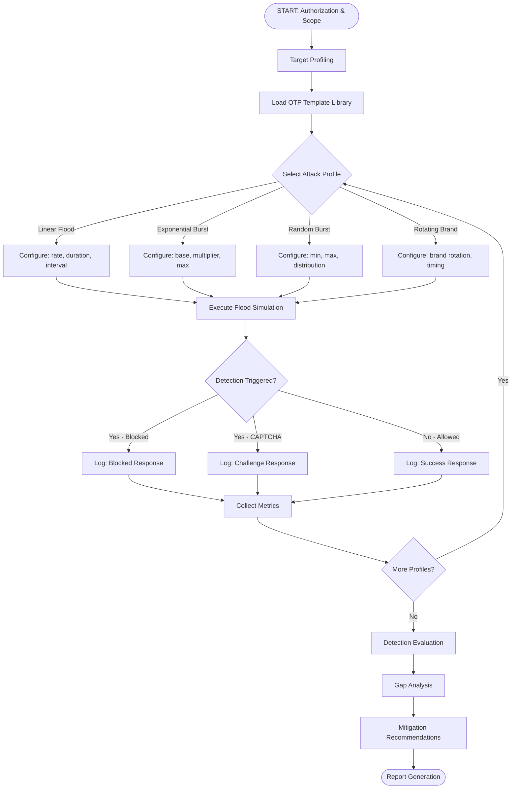
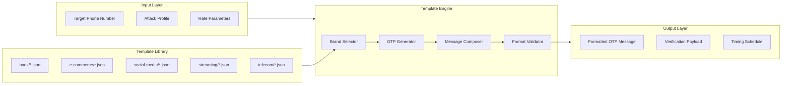
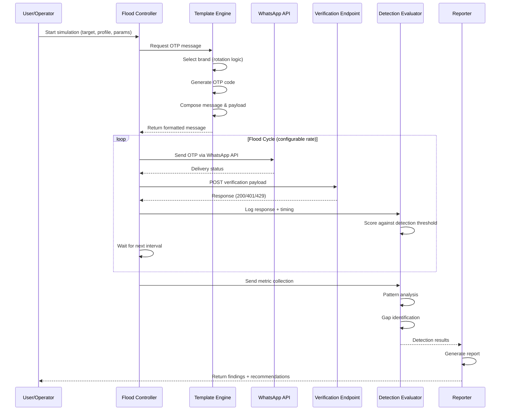
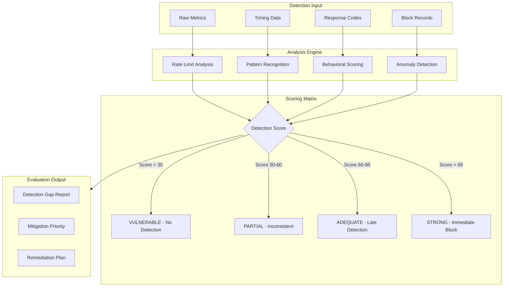
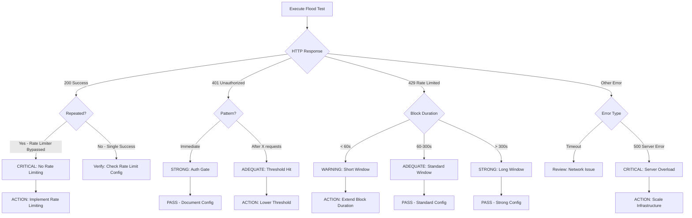
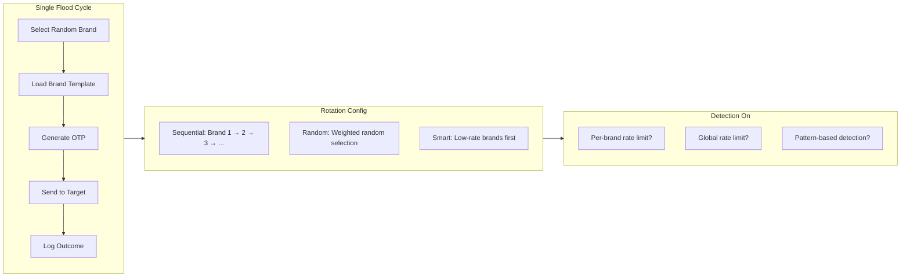
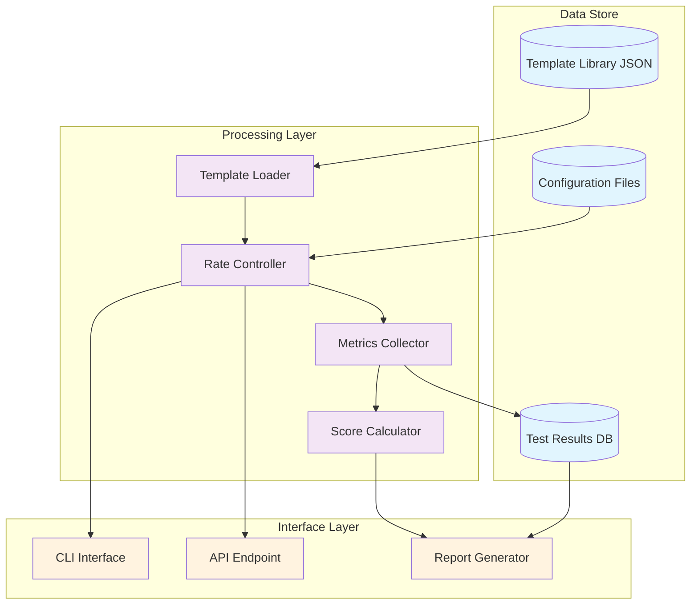

# OTP Flood Testing Framework — Process Flow

## 1. High-Level Process Flow

## 2. Template Engine Flow

## 3. Execution Flow Detail

## 4. Detection Evaluation Flow

## 5. Decision Tree — Testing Result Classification

## 6. Brand Rotation Strategy Flow

## 7. Data Flow Architecture

---

**Keterangan Warna Diagram:**
- 🔵 **Biru Muda** — Data Store (template, config, results)
- 🟣 **Ungu** — Processing Layer (loader, controller, collector, scorer)
- 🟠 **Oranye** — Interface Layer (CLI, API, report)

---

**7 diagram flow** mencakup:
1. **High-level process** — dari authorization sampai reporting
2. **Template engine** — input → library → output
3. **Execution sequence** — interaksi antar komponen secara real-time
4. **Detection evaluation** — scoring matrix + gap analysis
5. **Decision tree** — klasifikasi hasil testing berdasarkan response
6. **Brand rotation strategy** — cara menghindari deteksi per-brand
7. **Data flow architecture** — storage, processing, interface layers

Setuju dengan flow ini? Ada yang perlu ditambah atau diubah sebelum implementasi?
